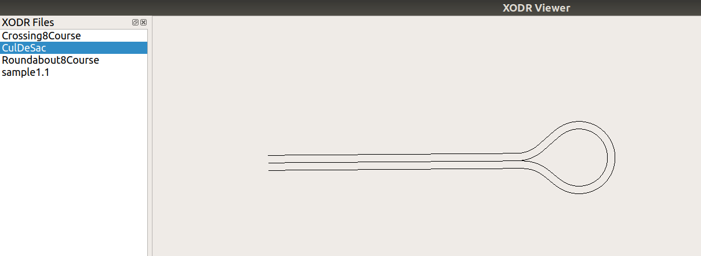

# hackatum-2019

We provide an XODR viewer, including a library to read XODR files. Inside the Viewer code (src/xodr_viewer/xodr_viewer_window.cpp:paintEvent) you will find the code that tesellates the road into polylines (lists of vertices). These polylines are what is used for the rendering.

Although tesellation into polylines is provided, there is no support for converting the resulting polylines into meshes, so the first proposed step is to implement this.

# Setup

## Ubuntu

1. Install dependencies

```
sudo apt-get install libeigen3-dev libtinyxml-dev qt5-default libboost-dev
```

2. Clone and Build the project

```
git clone --recurse-submodules https://github.com/jad-nohra-aid/hackatum-2019.git
cd hackatum-2019
make
```

3. Make will start the viewer and load the files, you should see something like this:




## Windows

You need the same libraries as the ones mentioned in the Ubuntu setup.
